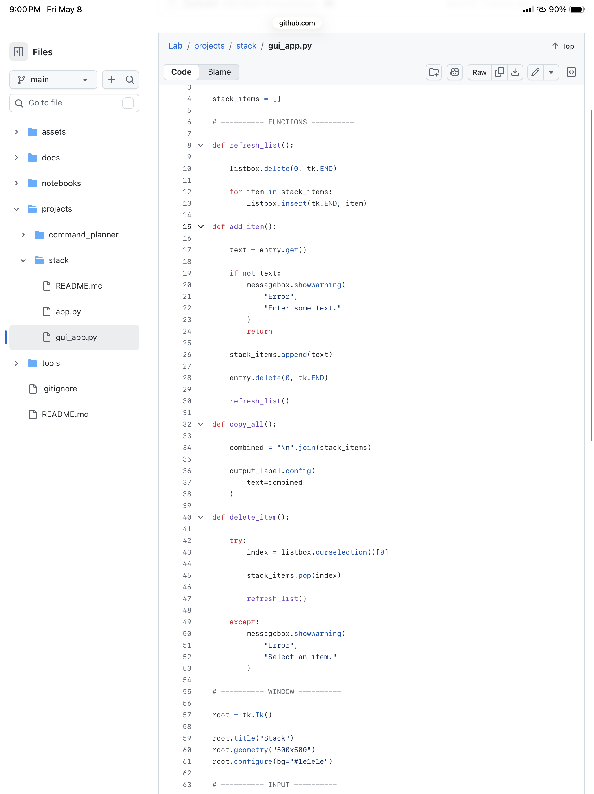

# Stack

A multi-item clipboard organizer for fast form filling and repetitive workflows.

## Idea

Stack allows users to save multiple pieces of copied text and combine them into a single paste action.

Example:
- name
- date of birth
- address

Then copy everything at once.

## Planned Features

- Create stacks
- Save text snippets
- Copy all items together
- Simple mobile-friendly interface

## Status

Planning phase.
## GUI Version

Stack also includes a graphical desktop interface built with Tkinter.

Run the GUI version:

```bash
python gui_app.py
```

Features:
- Add items with buttons
- View stack in a list
- Delete selected items
- Copy combined output
## Preview


